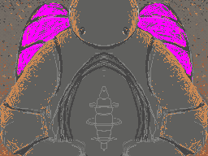
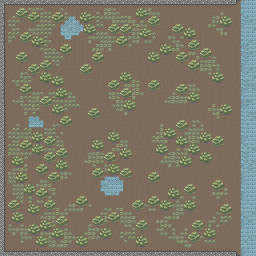
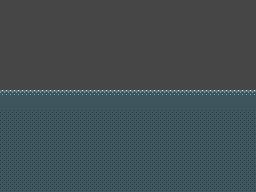

# Chilling Mech  Slavic Game Jam 2026

A Nintendo DS game about a moss-covered guardian mech rescuing forest animals from a wildfire. Blow into the DS microphone to cool your overheating reactor. Stay calm while everything burns.

<p align="center">"The theme is <em>chill</em>, and the whole game is designed around staying calm while everything around you burns."</p>

---

## The game

You are an ancient guardian mech, overgrown with vines and wildflowers — the last protector of a forest that no longer remembers you. Inside your warm inner chamber, lined with moss and fireflies, you carry the animals you save. At its center sits your vital reactor: it keeps the creatures alive, and it runs hot.

**Rescue animals. Quench flames with river water. Keep your reactor cool — by blowing on it.**



---

## Features

- **Blow-to-cool** — overheat your reactor and you must blow into the DS microphone to bring it back down. Steam rises. The screen frosts over with your breath.
- **Living HUD** — the top screen is the inside of the mech itself. Heat is the reactor's glow. Water is the tank's level. Animals are the creatures gathered inside.
- **Stylus-aimed water spray** — tap or drag on the touch screen to direct water and extinguish fires.
- **Wildlife AI** — hares sprint in zig-zags, hedgehogs curl up and wait for rescue, foxes follow if you walk slowly. Each species behaves differently.
- **Spreading fire** — the blaze grows tile by tile, driven by wind. Embers rain down and re-ignite cleared patches.
- **No kill-clock** — the fire spreads, but there is no timer. The game rewards steady, gentle play.
- **Healing forest** — flowers bloom where you put out fires. The world thanks you.
- **Nightfall finale** — the last level is at night. Fire glows in the dark, and rescued animals light your path with their eyes.

---

## Controls

| Input             | Action                                   |
|-------------------|------------------------------------------|
| D-Pad             | Move the mech                            |
| A                 | Scoop / carry an animal                  |
| B                 | Pick up water at a river or pond         |
| Touch (stylus)    | Tap / drag to aim the water spray        |
| **DS microphone** | **Blow to cool the overheating reactor** |

---

## Screenshots

> Screenshots coming soon — for now, here is the art that makes up the game.

| Mech                                  | Animals                              | Reactor                            |
|---------------------------------------|--------------------------------------|------------------------------------|
|  |  |  |

| Forest map                   | Chamber                              | Water tank                          |
|------------------------------|--------------------------------------|-------------------------------------|
|  |  |  |

---

## Build

Requires [BlocksDS](https://github.com/blocksds) with [NightFox's Lib](https://github.com/nflib).

```sh
make          # build ROM (slavic2026.nds)
make run      # build + run in melonDS
make clean    # remove artifacts
```

Asset pipeline: PNGs in `assets/` → GRIT → `nitrofiles/` → NitroFS. Graphics are 256-color tiled backgrounds and sprites via NFLib. Audio via mmutil.

---

## Tech

- **Platform**: Nintendo DS (ARM9)
- **Language**: C (GNU17)
- **SDK**: BlocksDS
- **Graphics**: NightFox's Lib (NFLib)
- **Asset pipeline**: GRIT + mmutil

---

## Contributors

Made for **Slavic Game Jam 2026**.

| Role   | People                                                  |
|--------|---------------------------------------------------------|
| Code   | NamespaceV, Grafiszti, Szymon Rzosiński, Piotr Kasprzyk |
| Art    | yreron                                                  |
| Design | all                                                     |
| Audio  | Justyna Kryścio-Rzosińska                               |

---
